# mermaid-demo

## 概要

[mermaid公式](https://mermaid-js.github.io/mermaid/#/)に載っているサンプルをGitHubで書いたときの見た目を確認する

### 気になった点
- 公式サンプルよりも全体的に色味が薄い
- Previewを確認するたびにすべての画像が再レンダリングされて待ち時間が発生するため、図をたくさん書く場合はGitHub上で直接編集するよりも別のリアルタイムプレビュー付きのエディター(存在するかは未調査)で作成してコピペした方が効率が良さそう

### オンラインエディター

[mermaid-js公式オンラインエディター](https://mermaid-js.github.io/mermaid-live-editor/edit/#pako:eNpVkE1qw0AMha8ia9VCfAEvCo2dZhNoodl5shAeOTMk88NYpgTbd-84aaHVSuh9ek9owi5oxgrPiaKBY6M85Hpta5PsII6GE5Tly7xnARc832bYPu0DDCbEaP35-cFvVwjq6bBiDGKsvxRFsTzU-m7x7nmGpj1QlBBPf5XjV5hh19oPkxP-KyZx3npre6p6KjtKUFO6I7hBx8mR1fn6aZ0oFMOOFVa51dzTeBWFyi8ZHaMm4Z22EhJmq-vAG6RRwufNd1hJGvkXaizlZ7gfavkGfhNdQA) 

## Flowchart

## Sequence diagram

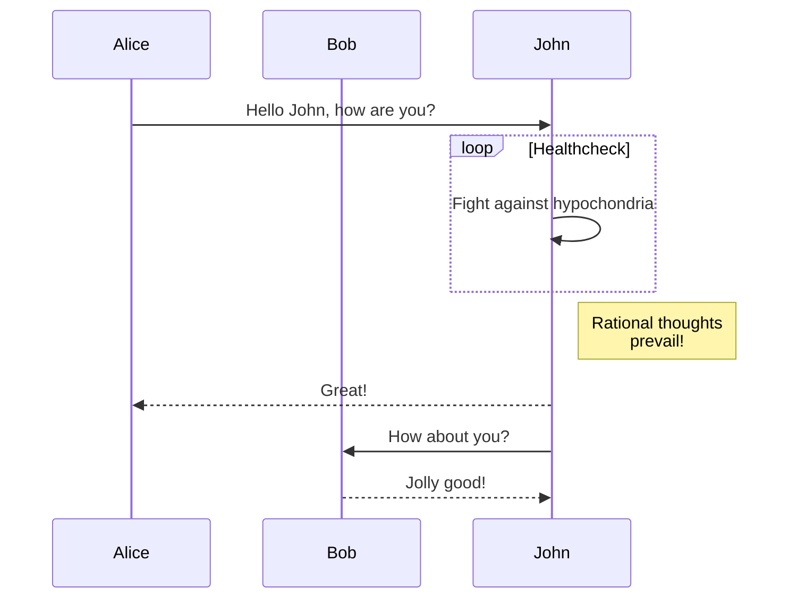

## Gantt diagram

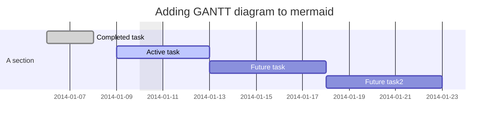

## Class diagram

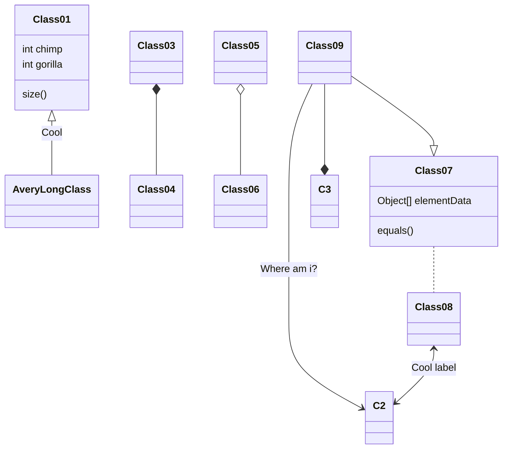

## Git graph - exclamation experimental

グラフ上に乗る文字の色が薄くてちょっと読みにくい。

## Entity Relationship Diagram - exclamation experimental

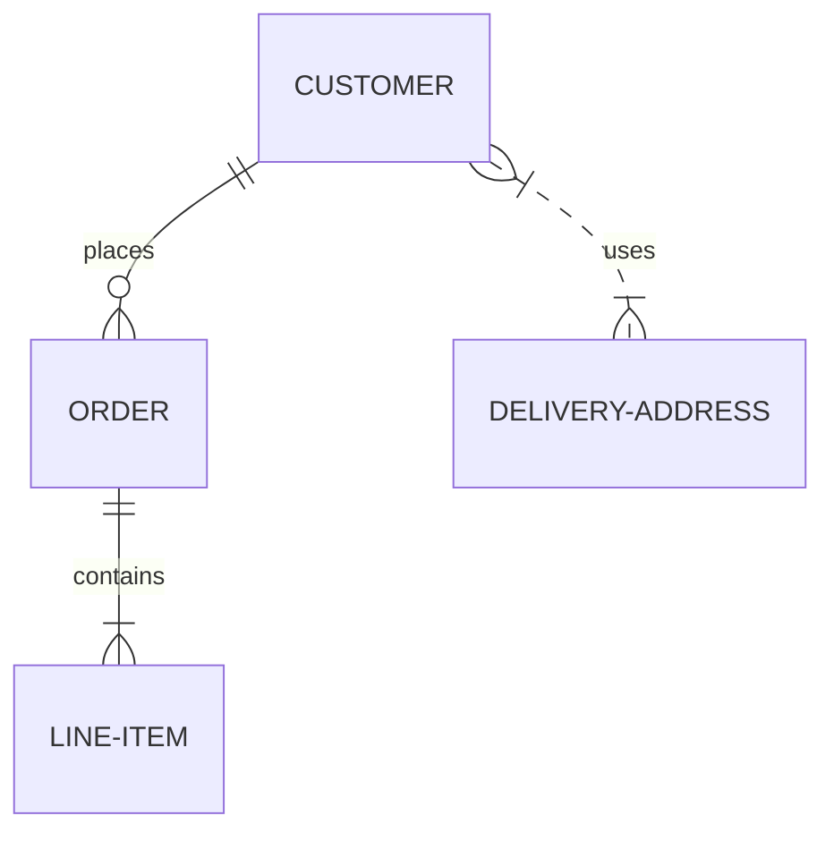

## User Journey Diagram

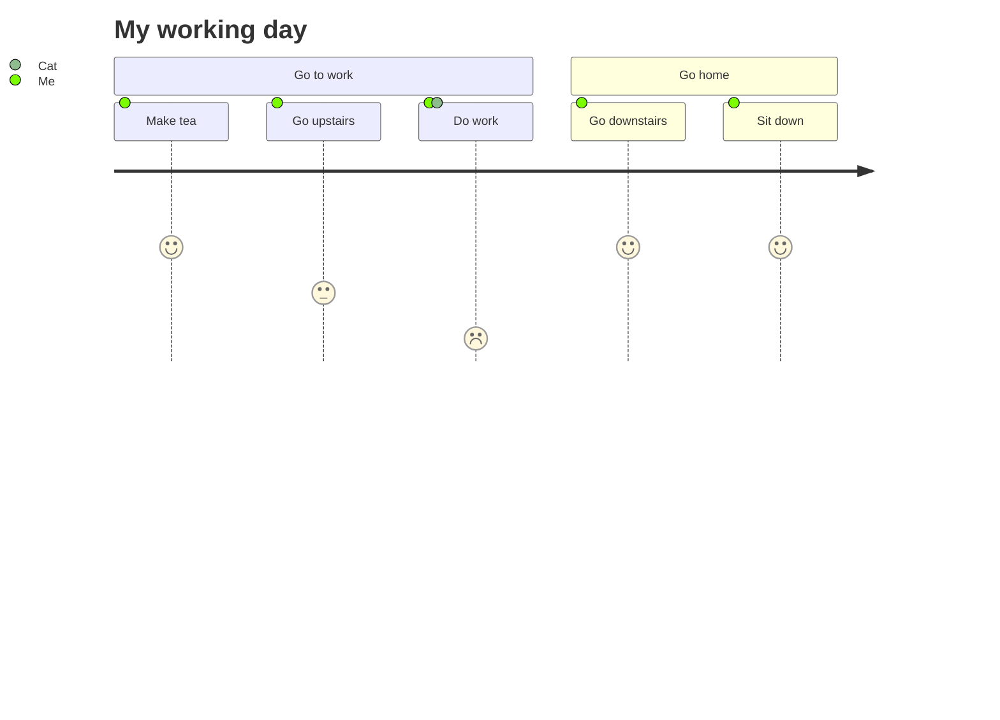

---

以下は、[mermaid公式のサンプルの一部](https://mermaid-js.github.io/mermaid/#/examples)を同じようにGitHubでの描画確認

## Basic Pie Chart

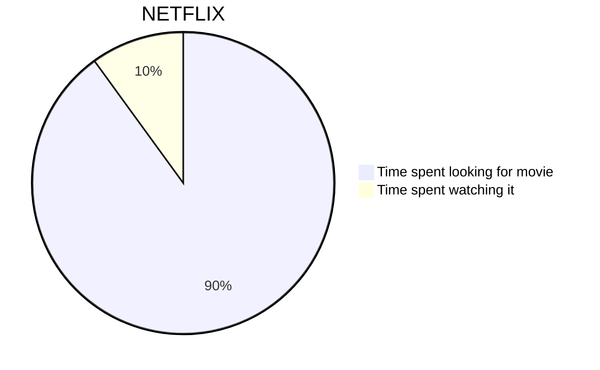

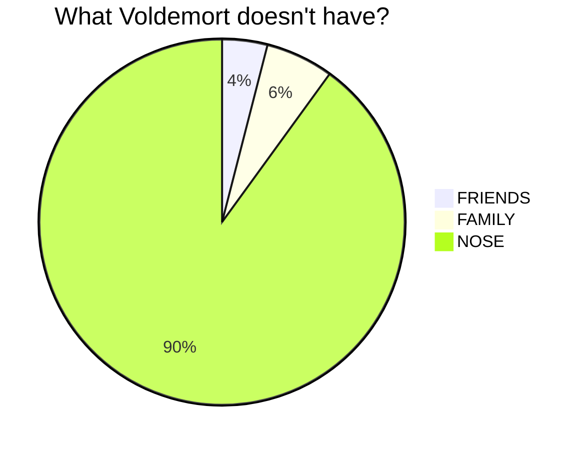

## Basic sequence diagram

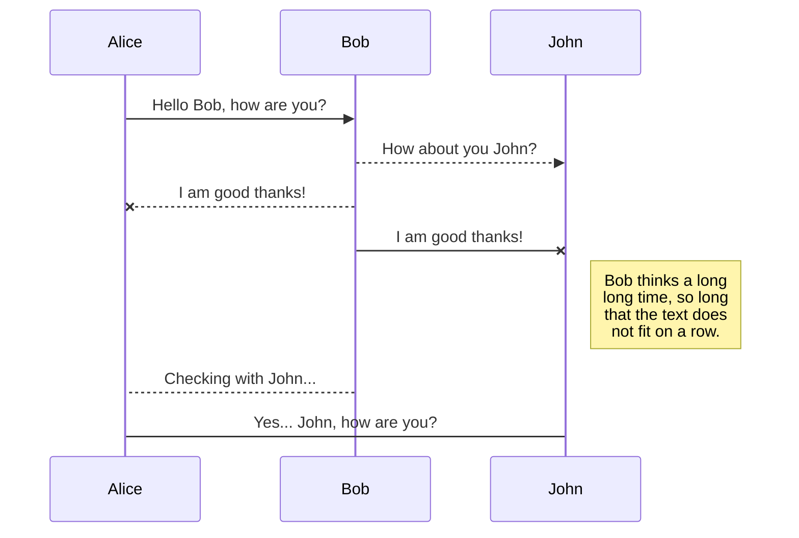

## Basic flowchart

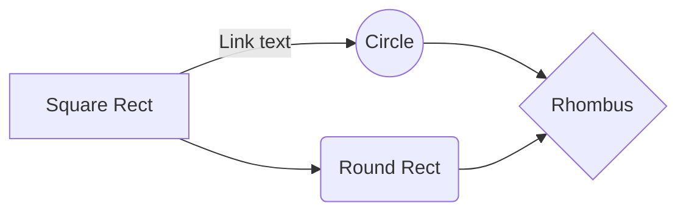

## Larger flowchart with some styling

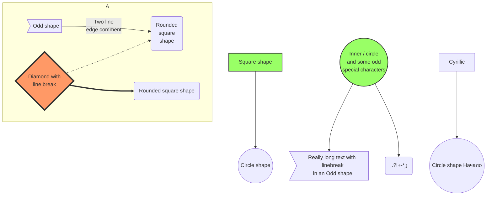

## SequenceDiagram: Loops, alt and opt

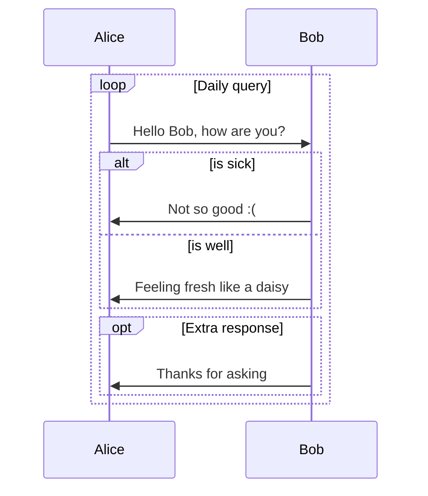

## SequenceDiagram: Message to self in loop

